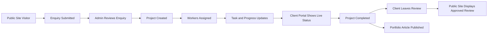
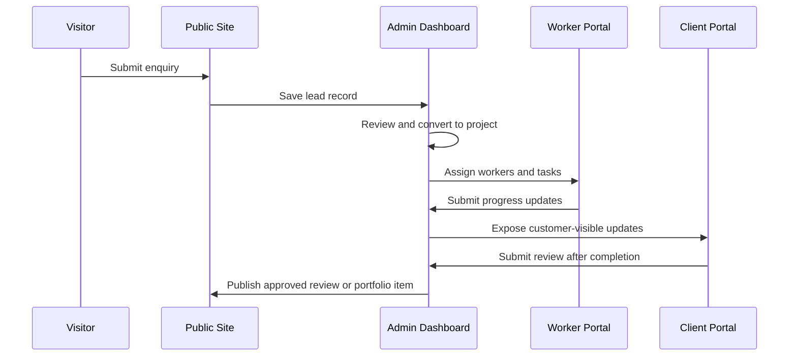

# KP Enterprise Software — Data Flow

This document describes how data moves through KP Enterprise Software across the four portals:

- **Public Site**
- **Client Portal**
- **Worker Portal**
- **Admin Dashboard**

The platform is designed to take a visitor from first contact through to project completion, review, and future repeat business.

---

## High-Level Flow

---

## End-to-End Business Flow

### 1. Visitor enters the Public Site

A prospect visits the Public Site to learn about KP Enterprise, view services, and inspect completed work.

**Data created or read:**

- service information
- portfolio items
- testimonials
- contact details
- enquiry form input

### 2. Visitor submits an enquiry

The visitor completes a contact form or quote request form.

**The system stores:**

- name
- phone number
- email address
- selected service
- enquiry message
- enquiry status
- timestamp

This enquiry becomes a lead in the system.

### 3. Admin reviews the enquiry

The Admin Dashboard receives the new lead. The operations team reviews the enquiry, determines feasibility, and decides whether to proceed.

**Possible outcomes:**

- mark as new
- request more information
- convert into project
- close as not actionable

### 4. Project is created

When the lead is approved, the admin creates a project record.

**The project links together:**

- customer
- service type
- estimated value
- project title
- project dates
- status
- internal notes

At this point, the enquiry becomes operational work.

### 5. Customer account is linked

The customer is associated with the project and given access to the Client Portal.

**This enables:**

- secure login
- private visibility into their own project
- controlled communication and progress tracking

### 6. Workers are assigned

The admin assigns one or more workers to the project.

**The system records:**

- project assignment
- worker identity
- assigned date
- role on the job
- expected tasks

This creates accountability and enables execution in the Worker Portal.

### 7. Tasks are created and updated

Tasks are created for the project and assigned to workers.

**Workers can then:**

- view assigned tasks
- update task status
- add work notes
- upload progress photos
- mark tasks complete

This is the operational heartbeat of the system.

### 8. Progress updates are visible to the customer

Certain progress updates are marked as customer-visible. These updates appear in the Client Portal.

**The customer can see:**

- current status
- timeline updates
- uploaded photos
- milestone progress
- completion state

This reduces the need for manual follow-ups and site visits.

### 9. Project completion

When the project is finished, the admin or operations team marks it as completed.

**Completion may trigger:**

- final customer notification
- review request
- portfolio eligibility
- archive status

### 10. Customer leaves a review

After completion, the customer may submit a review through the Client Portal or a linked public review form.

**The review includes:**

- rating
- comment
- project reference
- approval status

Once approved, it can be shown on the Public Site.

### 11. Completed project becomes portfolio content

Selected completed projects can be transformed into portfolio articles.

**This supports:**

- marketing
- credibility
- case studies
- future customer conversion

---

## Portal-to-Data Mapping

### Public Site

The Public Site consumes published, non-sensitive data:

- service catalog
- portfolio articles
- approved reviews
- contact and enquiry forms

### Client Portal

The Client Portal shows authenticated customer data:

- their projects
- status timeline
- media uploads
- progress notes
- reviews and review history

### Worker Portal

The Worker Portal shows execution data:

- assigned projects
- assigned tasks
- due dates
- work notes
- photo uploads
- completion status

### Admin Dashboard

The Admin Dashboard has full operational control:

- lead management
- project creation
- worker assignment
- customer management
- review moderation
- portfolio publishing
- internal reporting

---

## Key Data Relationships

The core system relationships are:

- one **Customer** can have many **Projects**
- one **Project** can have many **Tasks**
- one **Project** can have many **ProgressUpdates**
- one **Project** can have many **MediaFiles**
- one **Project** can have many **Reviews**
- one **Project** can have many **ProjectAssignments**
- one **Worker** can be assigned to many **Projects**
- one **Review** can have many **ReviewComments**

These relationships allow the business to track the full lifecycle of work from lead to completion.

---

## Data Handling Principles

To keep the system reliable and secure, the following principles apply:

### 1. Role-based visibility

Users only see data relevant to their role.

### 2. Project scoping

Customer data is isolated to the project or account it belongs to.

### 3. Event-driven updates

Certain actions should trigger downstream updates, such as:

- enquiry created
- project assigned
- task completed
- review submitted
- portfolio article published

### 4. Media references

Uploaded files should be stored in cloud file storage, while MongoDB stores the metadata and file references.

### 5. Auditability

Important state changes should be logged so the business can understand who changed what and when.

---

## Simplified Flow Diagram

---

## Outcome

The data flow in KP Enterprise Software is intentionally designed to support one complete operational journey:

**visitor → lead → project → task execution → customer visibility → completion → review → portfolio**

This ensures the platform serves both operational needs and business growth.
